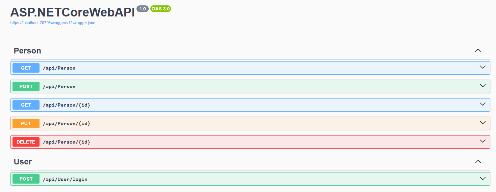

# asp-net-core-vue-mongo-crud
An Application that performs CRUD operations with ASP.NET Core, Vue.js and MongoDB.

`MyDatabase\Person`
```json
"_id": "675c2d4293288cbe554e61ed",
"Name": "Doğukan",
"Age": 24,
"Email": "example@gmail.com"
```

`MyDatabase\Users`
```json
"_id": "e9b1c455167344c99224b9a9c96e987a",
"Username": "admin",
"Password": "8c6976e5b5410415bde908bd4dee15dfb167a9c873fc4bb8a81f6f2ab448a918"
```

